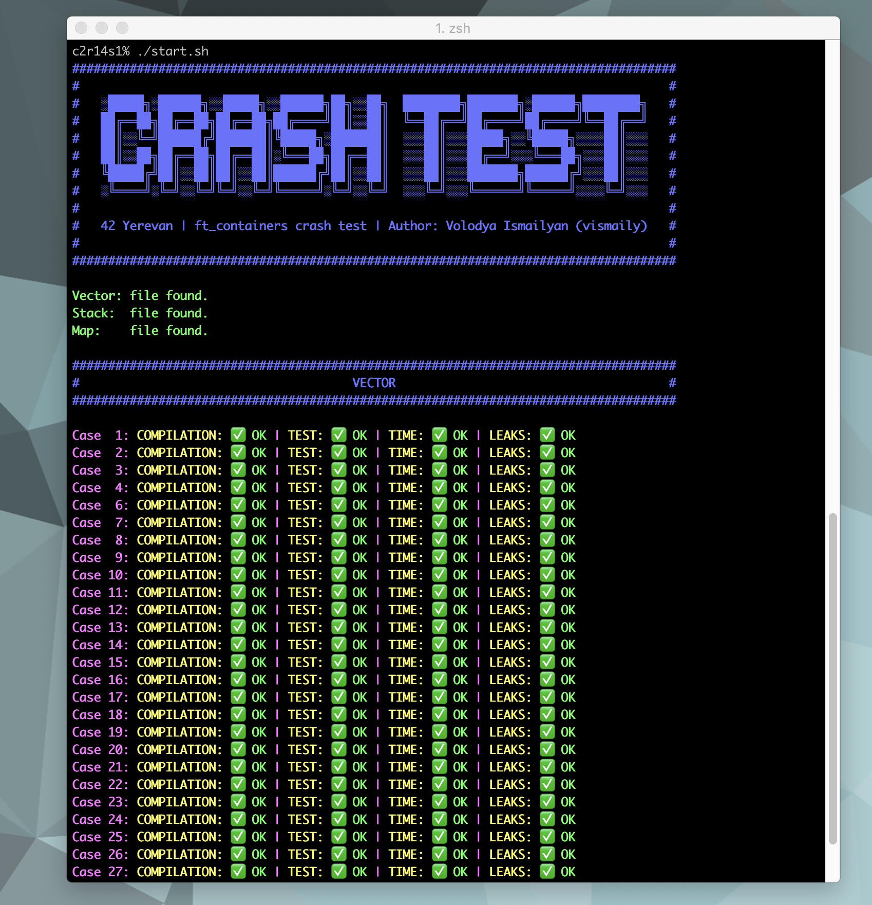

# 42_Ft_containers_Crash_test

<span><b>42_Ft_containers-Crash-test</b></span> is a complete tester for Ft_containers project of 42 school.

## Description

<b>Crash test</b> is allowing you test your containers: <b>vector</b>, <b>stack</b>, <b>map</b> in <b>ft</b> namespace.<br>
This test checks the majority of subject and checklist requires.<br>
Test doesn't check something you don't need to implement and was written by students.

## Usage

First of all you need to configure file ```config.sh``` and write correct paths of your classes.<br>
If you haven't some class implementation yet, for example <b>map</b>, you need to <b><i>comment</i></b> appropriate line in ```config.sh```:
```c++
# map='../map.hpp'
```
### Run

```shell
./start.sh       # for all
./start.sh -v    # for vector
./start.sh -s    # for stack
./start.sh -m    # for map
./start.sh -s -m # for stack and map, etc
```
___
### Additional information
I'm waiting for your bugs or suggestions for improving.


